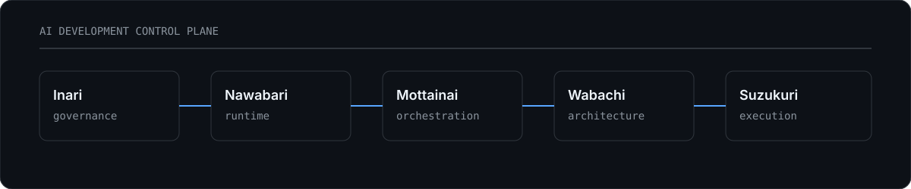

 

 

I build developer infrastructure for AI coding agents: systems that turn human intent into governed, isolated, and verifiable execution.

The central idea is simple: important behavior should live in contracts, state machines, policy, architecture, and runtime boundaries rather than depending on an agent remembering a prompt.

The stack

<table>
<tr>
<td width="33%" valign="top">

Inari

Governance

Canonical development lifecycle, policy enforcement, controlled mutations, provider boundaries, and machine-readable execution contracts.

</td>
<td width="33%" valign="top">

Nawabari

Runtime

Worktree-isolated coding sessions with explicit ownership, authorization, recovery, filesystem boundaries, and deterministic cleanup.

</td>
<td width="33%" valign="top">

Mottainai

Orchestration

Agent orchestration and semantic context projection designed to minimize unnecessary context while preserving execution-critical information.

</td>
</tr>
<tr>
<td width="33%" valign="top">

Wabachi

Architecture

Machine-readable architectural intent: explicit, queryable, renderable, and consumable by both humans and coding agents.

</td>
<td width="33%" valign="top">

Suzukuri

Execution

Governed transition from declared work to agent execution, with explicit admission, capability, and verification boundaries.

</td>
<td width="33%" valign="top">

Shikitari

Canon

Discovery, representation, and application of repository conventions and operational rules as machine-readable canon.

</td>
</tr>
</table>

Engineering model

<table>
<tr>
<td width="20%" align="center"><strong>DECLARE</strong> human intent</td>
<td width="20%" align="center"><strong>CONSTRAIN</strong> canon + policy</td>
<td width="20%" align="center"><strong>ISOLATE</strong> runtime</td>
<td width="20%" align="center"><strong>EXECUTE</strong> agent</td>
<td width="20%" align="center"><strong>VERIFY</strong> evidence</td>
</tr>
</table>

Automation with boundaries. Automate what can be deterministic; preserve explicit human decision points where judgment is required.

Principles

Principle

Operational meaning

01

Contracts over prompts

Critical behavior is represented as executable policy, structured data, or state transitions.

02

Isolation over convention

Safety properties are enforced by the runtime rather than left as instructions.

03

Evidence over confidence

Completion is demonstrated through diffs, tests, checks, artifacts, and observable state.

04

Canon over duplication

Governance and architecture have canonical sources and are projected where required.

05

Bounded autonomy

Agents receive enough authority to execute, but not enough to silently redefine the contract.

Activity

 

Working surface

  

<code>coding agents</code>  
<code>governance</code>  
<code>orchestration</code>  
<code>state machines</code>  
<code>semantic architecture</code>  
<code>isolated runtimes</code>  
<code>MCP</code>

 

Govern the intent. Isolate the execution. Verify the result.

