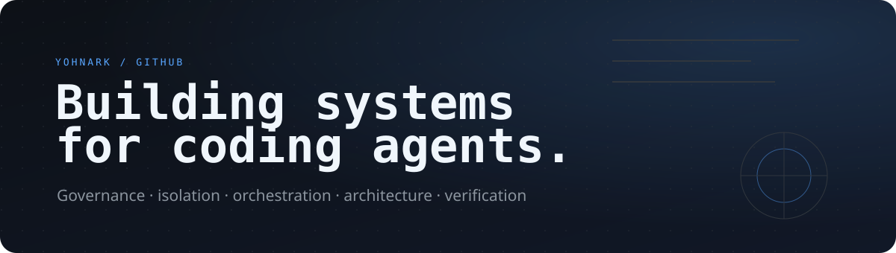

<div align="center">



<br>

<a href="https://github.com/yohn-jp"></a>


</div>

## About

I build developer infrastructure for AI coding agents.

The work is centered on a simple engineering problem: **how to let agents act autonomously without making authority, architecture, or verification implicit**.

That leads to systems for governance, isolated execution, orchestration, machine-readable architecture, admission control, and evidence-driven completion.

## What I'm building

<table>
<tr>
<td width="50%" valign="top">

### [Inari](https://github.com/yohn-jp/gh-inari)
**Governance and lifecycle**

Canonical development contracts, policy enforcement, controlled mutations, and lifecycle state for AI-driven engineering.

### [Mottainai](https://github.com/yohn-jp/mottainai)
**Orchestration and context**

Agent orchestration and semantic context projection, with an emphasis on giving agents only the context they actually need.

### [Suzukuri](https://github.com/yohn-jp/suzukuri)
**Admission and execution**

The boundary between declared work and governed execution: admission, capabilities, execution, and verification.

</td>
<td width="50%" valign="top">

### [Nawabari](https://github.com/yohn-jp/nawabari)
**Runtime and isolation**

Worktree-isolated coding sessions with explicit ownership, authorization, recovery, and filesystem boundaries.

### [Wabachi](https://github.com/yohn-jp/wabachi)
**Architecture and documentation**

Machine-readable architectural intent that can be queried, rendered, and consumed by both humans and coding agents.

### [Shikitari](https://github.com/yohn-jp/shikitari)
**Repository canon**

Discovery and application of repository conventions as explicit, machine-readable canon.

</td>
</tr>
</table>

## The model

```text
human intent
    |
    v
canonical contract
    |
    v
governance + architecture
    |
    v
admission
    |
    v
isolated runtime
    |
    v
agent execution
    |
    v
evidence + verification
```

The recurring design principle is **bounded autonomy**: automate deterministic work aggressively, but keep authority and engineering contracts explicit.

## Current interests

`coding agents` · `agent governance` · `runtime isolation` · `orchestration` · `state machines` · `semantic architecture` · `MCP` · `Nix`

## Working surface

<div align="center">


</div>

## How I think about agent systems

- **Contracts over prompts** — important behavior should live in executable policy, structured data, or state transitions.
- **Isolation over convention** — safety properties should be enforced by the runtime, not left as instructions.
- **Evidence over confidence** — completion should be demonstrated through observable artifacts, checks, and state.
- **Canon over duplication** — governance and architecture should have a source of truth and be projected where needed.
- **Automation with boundaries** — automate what is deterministic; preserve explicit human judgment where it matters.

---

<div align="center">
<sub>Govern the intent. Isolate the execution. Verify the result.</sub>
</div>
