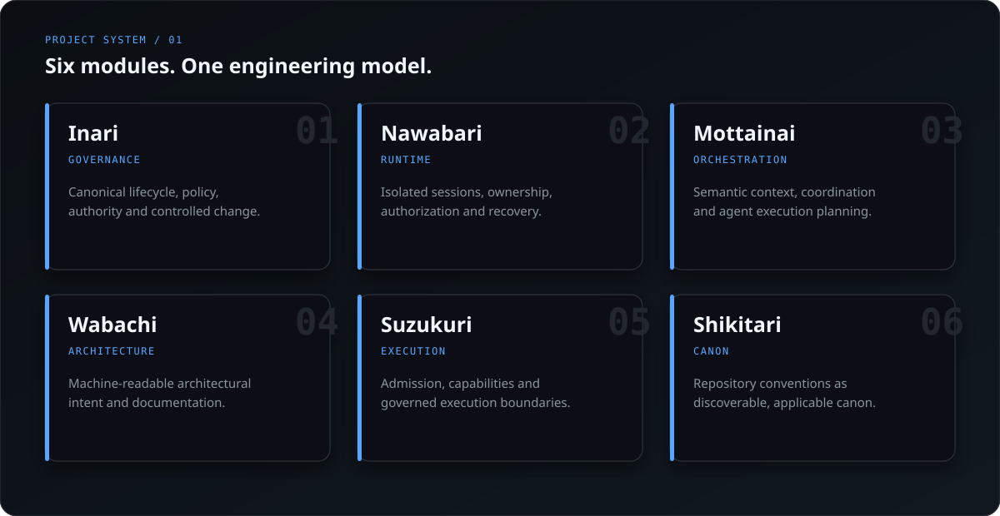
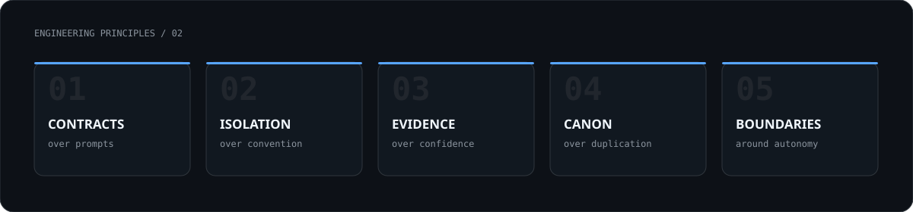

  

 

<table>
<tr>
<td width="62%" valign="top">

### Building the control plane for coding agents

I build the infrastructure around AI coding agents: **governance, isolation, orchestration, architecture, admission, and verification**.

The objective is bounded autonomy. Deterministic work should be automated aggressively; authority and engineering contracts should remain explicit.

</td>
<td width="38%" valign="top">

<pre>
DECLARE
   ↓
CONSTRAIN
   ↓
ISOLATE
   ↓
EXECUTE
   ↓
VERIFY
</pre>

</td>
</tr>
</table>

 

  

[**INARI**](https://github.com/yohn-jp/gh-inari) ·
[**NAWABARI**](https://github.com/yohn-jp/nawabari) ·
[**MOTTAINAI**](https://github.com/yohn-jp/mottainai) ·
[**WABACHI**](https://github.com/yohn-jp/wabachi) ·
[**SUZUKURI**](https://github.com/yohn-jp/suzukuri) ·
[**SHIKITARI**](https://github.com/yohn-jp/shikitari)

  

 

> **The system should carry the rules.** Agents should spend their reasoning budget on engineering work, not on remembering operational conventions.

 

### Working surface

  

<code>coding agents</code>&nbsp;&nbsp;
<code>governance</code>&nbsp;&nbsp;
<code>orchestration</code>&nbsp;&nbsp;
<code>state machines</code>&nbsp;&nbsp;
<code>semantic architecture</code>&nbsp;&nbsp;
<code>isolated runtimes</code>&nbsp;&nbsp;
<code>MCP</code>

  

Govern the intent. Isolate the execution. Verify the result.

